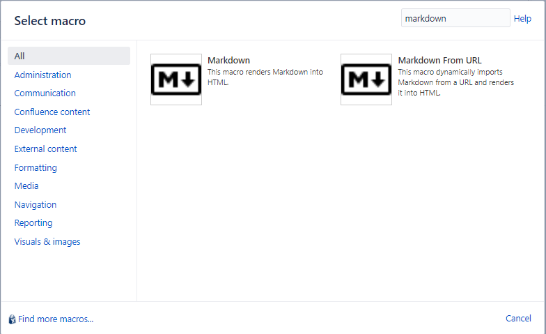
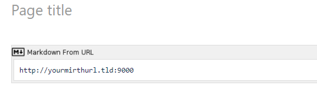
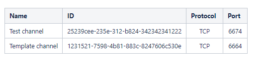

# Get all ports used by channels

This channel exports a Markdown table of channels containing channel name, it's id, it's protocol and the port it's listening on.
I am using this channel in conjunction with a [plugin for confluence](https://marketplace.atlassian.com/apps/1211438/markdown-macro-for-confluence), to export an easily viewable table of all used ports so I can easily assign new ports to new devices without the hassle of checking each channel separately or deploying a channel and waiting for a binding conflict message.

### Sample table
| Name | ID | Protocol | Port |
| :--- | :--- | :----: | :----: |
| Test channel | 25239cee-235e-312-b824-342342341222 | TCP | 6674 |
| Template channel | 1231521-7598-4b81-883c-8247606c530e | TCP | 6664 |

## Usage
Note this is how I use this channel. You can do whatever you like
1. Import channel
1. Set channel port to whatever you fancy
1. Install [Markdown macro for Confluence](https://marketplace.atlassian.com/apps/1211438/markdown-macro-for-confluence)
1. Select `Markdown from URL` from macro insertion dropdown (Image 1)
1. Insert `http://yourmirthurl.tld:9000` (Image 2)
1. ???
1. Profit (Image 3)

## Images
Image 1: Macro selection

Image 2: Macro url

Image 3: Profit

